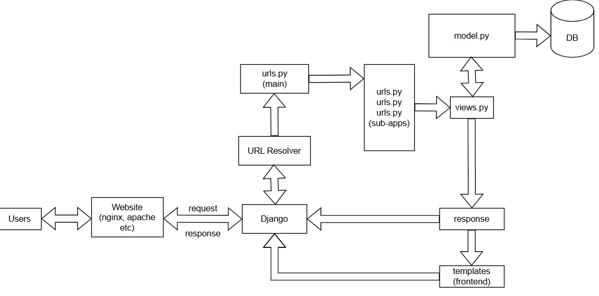

# Installation and Setup of Django
__Step 1:__ <br>
Open cmd and instal django in the local computer.
```
pip install django
```
__Step 2:__ <br>
Install virtual environment wrapper.
```
pip install virtualenvwrapper-win
```
__Step 3:__ <br>
Create virtual environment.
```
mkvirtualenv venv
```
__Step 4:__ <br>
Install django in virtual environment(not mandatory).
```
pip install django
```
__Step 5:__ <br>
Create project in the desired folder. Go to the desired folder.
```
django-admin startproject myproject
```
__Step 5:__ <br>
Go to myproject folder and open in IDE or type,
```
code .
```
You can also activate and deactivate the virtual environment.
__To deactivate__:
```
deactivate
```
__To activate__:
```
workon venv
```
__Step 6__:
Create a django custom app.
```
python manage.py startapp mosquitt
```
Then, we need to include this app in `urls.py` main-app file.
```
urlpatterns = [
    path('admin/', admin.site.urls),
    path('', include('mosquitt.urls'))
]
```
Then, include the name of the project(sub-app) in `settings.py`.
```
INSTALLED_APPS = [
    'django.contrib.admin',
    'django.contrib.auth',
    'django.contrib.contenttypes',
    'django.contrib.sessions',
    'django.contrib.messages',
    'django.contrib.staticfiles',
    'mosquitt',
]
```

__Step 7__:
How to run server after doing the URL routing.
```
python manage.py runserver
```
---
# URL Routing:
1. Routes are written inside the `urls.py` file in the sub-folder(mosquitt).
```
urlpatterns = [
    path('', views.index, name='index'),
    path('blogs/', views.blogs, name='blog'),
    path('about/', views.about, name='aboutpage'),
    path('about/radwan/', views.radwan, name='aboutpage'),
]
```
Now, we need to give this to the main-folder(myproject) `urls.py` file.
```
urlpatterns = [
    path('admin/', admin.site.urls),
    path('', include('mosquitt.urls'))
]
```
2. Now the functions(blogs, about, radwan, index) are written inside `views.py` file in the sub-folder.
```
def index(request):
    return render(request, 'index.html')

def blogs(request):
    return render(request, 'blog.html')

def about(request):
    return render(request, 'about.html')

def radwan(request):
    return render(request, 'radwan.html')
```
3. These functions are render the frontends(.html files) in the template folder located in the base directory(where, `manage.py` located).
<hr>

# Django workflow:


<hr>

# Models in DJango.
Models are used to configure the Database. Models are located in the sub-apps(like, mosquitt). Creating a model inside `model.py`. Say we want to create a model for `features`,
```
class Feature:
    id: int
    name: str
    details: str
```
Now, to use the `Feature` call this in `views.py`:
```
def index(request):
    feature1 = Feature()
    feature1.id = 2010020
    feature1.name = 'Radwan'
    feature1.details = 'Studies in dept. of Electrical and Computer Engineering'

    return render(request, 'index.html', {'feature': feature1})
```
To render the informations in frontend,
```
<h1>Hey, this is {{feature.name}}'s blog page.</h1>
<p>ID: {{feature.id}}.<br>
    About him: {{feature.details}}
</p>
```
This is a static process and inefficient also. We can make it dynamic by creating a list,
```
features = [feature1, feature2, feature3]

return render(request, 'index.html', {'features': features})
```
And rendering this in frontend,
```

<h1>Hey, this is {{feature.name}}'s blog page.</h1>
<p>ID: {{feature.id}}.<br>
    About him: {{feature.details}}
</p>
<hr>

```
<hr>

# Database and Admin Panel
db.sqlite3 stores all our database in Django. Whenever we create a new Django project, databases already saved in sqlite. Creating a real database:
```
class Feature(models.Model):
    name = models.CharField(max_length=100)
    details = models.CharField(max_length=500)
```
Now we need to send these fields to our database. For this we need to make migrations,
```
python manage.py makemigrations
```
Then, migrate the fields,
```
python manage.py migrate
```
All these fields/database are initially pushed into admin panel. Now we need to register the model into our `admin.py` file:
```
admin.site.register(Feature)
```
To setup admin panel:
```
python manage.py createsuperuser
```
__Whenever, we make any changes in our model we must do these 2 steps of migration again and again, in order to keep the database upgraded.__
<hr>

## Getting data from admin panel and showing in frontend:
- `models` is linked with the database. Getting data from `Feature` database and storing inside list.
```
features = Feature.objects.all()
```
